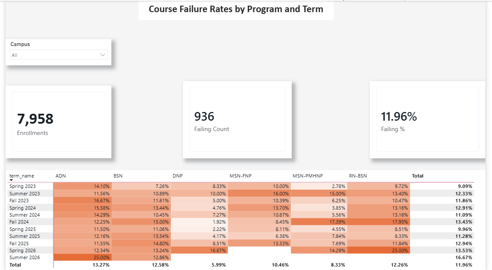

# Nursing Program Course Failure Analysis — Power BI

A Power BI report built on a Kimball-style star schema, analyzing course failure rates across six nursing programs over eleven academic terms.

> **All data is synthetic.** Generated with a seeded Python script (`generate_data.py`). No real student records.



## The question

Which programs and terms have unusually high course failure rates, and are those rates reliable enough to act on?

## Data model

One fact table at the grain of **one row per learner per course per term**, surrounded by conformed dimensions.

| Table | Rows | Role |
|---|---|---|
| `fact_course_enrollment` | 7,958 | Enrollment outcomes (passed, grade, score, attendance) |
| `dim_learner` | 1,400 | Campus, enrollment intensity, status |
| `dim_program` | 6 | BSN, ADN, MSN-FNP, MSN-PMHNP, RN-BSN, DNP |
| `dim_course` | 16 | Course code, category, credit hours |
| `dim_term` | 11 | Spring 2023 – Summer 2026, with `term_rank` |
| `dim_date` | 1,461 | Daily calendar (reserved for future time intelligence) |

All relationships are many-to-one, single-direction, from the fact table out.

## DAX measures

```dax
Enrollments = COUNTROWS('fact_course_enrollment')

Failing Count =
CALCULATE(
    COUNTROWS('fact_course_enrollment'),
    'fact_course_enrollment'[is_course_passed] = FALSE(),
    NOT ISBLANK('fact_course_enrollment'[is_course_passed])
)

Failing % =
DIVIDE(
    [Failing Count],
    CALCULATE(
        COUNTROWS('fact_course_enrollment'),
        NOT ISBLANK('fact_course_enrollment'[is_course_passed])
    )
)
```

## Design decisions

**Removed a snowflake path.** Power BI auto-detected two routes from the fact table to `dim_program`: directly, and through `dim_learner`. It kept the indirect one. That would assign every historical enrollment to a learner's *current* program, silently misreporting anyone who switched programs. I deleted the learner→program relationship so each enrollment is attributed to the program it was actually taken under.

**Blank-safe failure counting.** In-progress enrollments have a blank `is_course_passed`. DAX coerces blank to FALSE in comparisons, so `= FALSE()` alone counted all 133 in-progress rows as failures (1,069 instead of 936). Both numerator and denominator explicitly exclude blanks.

**Left `dim_date` unconnected.** The fact grain is termly, with no date column. Forcing a join would add nothing, so the daily calendar stays in the model for future day-level analysis.

**Chronological sort.** `term_name` is sorted by `term_rank` rather than alphabetically, so trends read top to bottom.

**Absolute color scale.** The heatmap runs from 0% to 20% fixed, rather than min-to-max, so a single small-sample cell can't set the range. Blank cells stay unformatted instead of rendering as 0%.

## What the data shows

- Overall failure rate is **11.96%** (936 of 7,825 completed enrollments).
- DNP runs lowest at about 6%; ADN highest at about 13%.
- Fall terms tend to run higher than spring.
- Fall 2024 spiked for MSN-PMHNP and RN-BSN (~17–18%).
- Summer 2026 is unreliable: the term is mostly in progress, so the denominator is small.

## Files

- `nursing-analytics.pbix` — the Power BI report
- `data/` — six CSVs
- `generate_data.py` — reproduces the CSVs exactly (`python generate_data.py`)
- `dashboard.png` — screenshot

## Tools

Power BI Desktop · DAX · Power Query · Python
